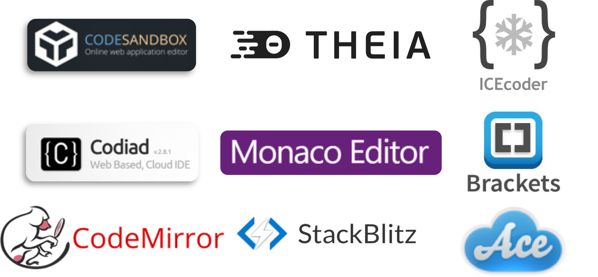
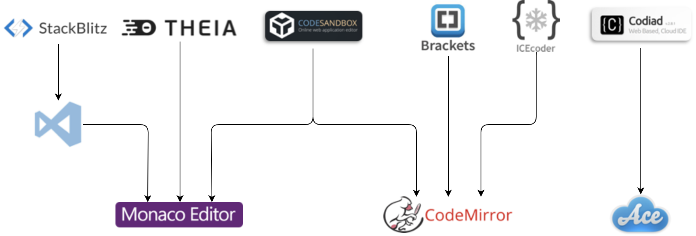

As a part of my bachelor thesis I informed myself about the current status of web-based IDEs.
This was needed to select an editor for which an extension of openVALIDATION should be implemented.
Another criteria for the editor was that it should be open-source that the implementation can be changed, if necessary.

In the context of the research there were not many sources and articles to find, which illuminate this topic.
I would like to change this with this post.

# Relevant IDEs #

So I started my research with just Google for `open-source web-based texteditors` and similar search queries.
I found quite much as you can see in the following picture.

But after taking a closer look to the source-code and documentation of the editors, I could filter mostly all of them out.
Not because some of them are erroneous, but because mostly all of them behave the same!
The reason for this is, that there are three base-editors and the other editors just use them and add functionalities like debugging.
The relationship between the editors is explained in the following picture.

As you can see, there are three base-editors that are used by the other editors.
Because we only want to add some language-functionalities, only the base-editors are relevant for us.
If you wonder why you see the `Visual Studio Code` Editor between the relation of `StackBlitz` and `Monaco`, that's because Monaco is the backplate of VSCode.
Technically, the core of monaco is exported from the vscode-repository.

So we will take a closer look to the `Monaco Editor`, `Ace` and `CodeMirror`.
Firstly I will explain the criteria for the choice in the following section.

# Criteria for selection #

Before selecting one of those three some additional research is required.
To do the research we first need to explain the criteria that is relevant.

The editor should first be well documented to make an extension easier.
Also it should support the Language-Server-Protocol (LSP) that we can use this protocol to implement an extension.

The community of an open-source editor is also highly relevant.
As a measurement I will look at some stats from GitHub and NPM.

| Criteria        | Are           | Cool  |
| ------------- |---------------| ------|-----|
| release-year     | right-aligned | $1600 |
| lsp-support     | centered      |   $12 |
| documentation | are neat      |    $1 |
| GitHub forks | are neat      |    $1 |
| GitHub stars | are neat      |    $1 |
| GitHub stars | are neat      |    $1 |
| GitHub contributors | are neat      |    $1 |
| Active GitHub contributors | are neat      |    $1 |
| npm downloads at Feb XXXXX  | are neat      |    $1 |
| npm download growth since Feb XXXXX  | are neat      |    $1 |

# Conclusion # 

Based on the defined criteria I would prefer using monaco because it is very well documented and supports the LSP.
In addition it has a active community and has a strong growth since the last year.
It already has more weekly downloads than `Ace`, although `Ace` is four years older than monaco.

I wrote this post after I started working with monaco for a few months and I'm still really happy about chosen this one.
If you have to make a similar decision I would really recommend you to use monaco.